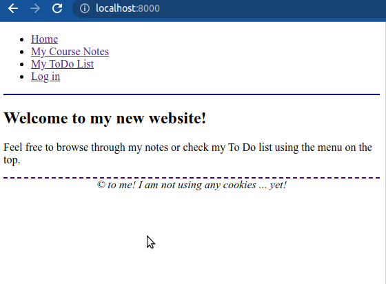
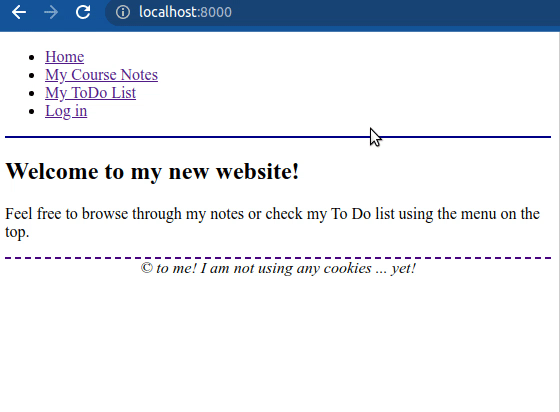

# Django Sessions

## Description

In this exercise, you will use Django's session object to keep track of the users state, allowing them to login (and stay logged in) and adding features to tailor and restrict the user's actions on the site.

## Data

For this exercise, you can use your own code from the exercise [Django Forms](https://github.com/dci-python-course/Python-basics-django-forms).

Alternatively, you can use the [solution provided](https://github.com/dci-python-course/Python-basics-django-forms/tree/solution_task4/solution/course) in the last task of the exercise.

> If you do so, make sure your virtual environment has all the necessary dependencies by moving into the `course` directory and typing:
>
> `(env) $ pip install -r requirements.txt`

## Tasks

### Task 1

One of the most common features in websites is the login feature.

In the previous exercise about Django forms you created an authentication form to hide the To Do content.

But now that form is making the To Do section a bit tedious to consult. You will refactor this, so that the front-end knows when a user has already logged in and when not.

Use the following guidelines:

- The login will be a common feature in the website. We want to hide the `todo` content, but we may want to add user oriented content also in other sections (Django apps) of the website.
- There will be a new option (link) with the title `Log in` in every page of the site (for instance, in the top header). This link will point to a new view `login/` with the authentication form.
- Upon submission, the form in `login/` will store the username in a session variable.
- Remove the form from the **todo details** view. This view should still check if the users are logged and if they are not, it will show a message notifying of the section privacy policy and will offer them the option to go to the **log in** view.
- When the user is already logged in, there should be no link on the header pointing to the **log in** view. Instead, there should be a link pointing to a **log out** new view that flushes the session.
- Additionally, the **log in** view will check if the users are already logged and, if they are, it will not show the form but will redirect them to the **home** view.

> Hint: To use database driven sessions (the default mode in Django) you will have to run the migrations first:
>
> `(env) $ python manage.py migrate`

**User data**

Download the file at [resources/task1/models.py](resources/task1/models.py) and replace the `models.py` file in your Django app. This file contains a user store that works exactly like the one used for the **notes** app.

This store has 4 initial users:

| User name | Password | Role   |
|-----------|----------|--------|
| admin     | admin    | admin  |
| james     | hendrix  | editor |
| fred      | baggins  | user   |
| ganesh    | the_grey | user   |

To do a first load of the users you will have to import the store in your `views.py` file and instantiate it. Then, create a variable named `users` that gets the output of the `store.get()` method.

```
from my_app.models import UserStore


store = UserStore()
users = store.get()
```

Replace `my_app` with the name of the app where you define the **log in** view.

**User validation**

The user passwords are stored using a hash and this means that you can't compare the user input directly with the stored password.

> Once you loaded the `UserStore` in your views restart the development server and check the file `data/users.json` in your repository to see how the passwords are stored.

To check if the input password matches the one stored, use Django's function `check_password`.

```
from django.contrib.auth.hashers import check_password

password_matches = check_password(input_value, stored_value)
```

To check if the user is logged in or not in the template you can use the request object. This object is automatically passed to the template:

```

    <p>Welcome, {{ request.session.user_name }}!</p>

    <p>You are anonymous</p>

```

**General steps**

1. Replace your models.py.
1. Create the `login/` path.
1. Create the view using `common.forms.LoginForm`
    1. When rendering the form, check if the user is already logged and redirect to the home if true.
    1. When submitting the form, check if the credentials are valid and redirect the user to the home if they are.
1. Add a link on the header. If the user is not logged the link will say `Log in` and will point to the **login** path. If the user is logged the link will say `Log out` and will point to the **logout** path (still to do).
1. Create the **logout** path (and view) that deletes the session variable `user_name`.
1. Change the **todo details** view so that it shows a message and a link to the login view instead of the form.

**Once finished, your website should look similar to this:**



### Task 2

Now you will work on the notes' creation and edition. For these two features, only registered users with the roles `admin` or `editor` should be granted access.

Use the same approach as before, but this time checking the role of the user.

> Hint: when the user logs in, you may store a new session variable named `can write_notes` or similar.

Change the template to render the form only if the users are logged and their role is either `admin` or `editor`. If they are not, show them a message pointing to the **login** view.

**Once you are done, your website should look similar to this:**


### Task 3

Now you will add a voting system for your notes. You want to know which note is the most important in each section, according to your visitors.

To do this, add a link on the **note details** view to let a user vote that note. Next to the link, show the total amount of votes given to the note.

The link should point to a new view that updates the total counter on the note and updates the list of votes of the logged user, then it redirects the user to the **note details** view.

If the visitor is not logged, instead of the link, a message should appear saying `You are not authorized` and pointing the user to the **log in** view.

If the user is logged, the link will be present, but only if the user didn't yet vote any note on a particular section.

If the logged user already voted one note in a section, instead of the link, a message indicating there is already a vote in the section should appear.

Additionally, check if the voted note is the same as the one on the view. If it is show a slightly different message saying the user already voted `this` note.

**About the data**

Before starting, replace the `common/models.py` file with the one at [resources/task3/common/models.py](resources/task3/common/models.py) and the `notes/models.py` with the one at [resources/task3/notes/models.py](resources/task3/notes/models.py).

> To load the new data, after copying the previous `models.py` files, remove the entire directory `data` in your repository and restart the development server.

These new files are like the original ones, but they include the following keys:

1. Each note in `notes.models.NoteStore` has an additional key named `votes` with an integer counter.
2. Each user in `common.models.UserStore` has an additional key named `voted_notes` with a list of integers representing the note ids.

> Remember you can access the data anywhere, by importing the corresponding store, instantiating it and calling its `get` method.
>
> **Hint**: To show the appropriate voting options to the user you can user a custom template tag, that takes the request and the note id as arguments and returns an HTML string.
>
> You can use the function `mark_safe` to let the template know this output should be rendered as HTML. Example:
>
> **templatetags/my_tags.py**
> ```
> from django.utils.html import mark_safe
>
> ...
> def my_tag():
>    return mark_safe("<p>My HTML code</p>")
> ```

**Refreshing the data**

To start again with a fresh copy of the data follow this steps:

1. Remove the entire `data` directory in your repository.
1. Restart Django's development server.
1. Logout from the front-end.

**Once you are done, your website should look similar to this:**


